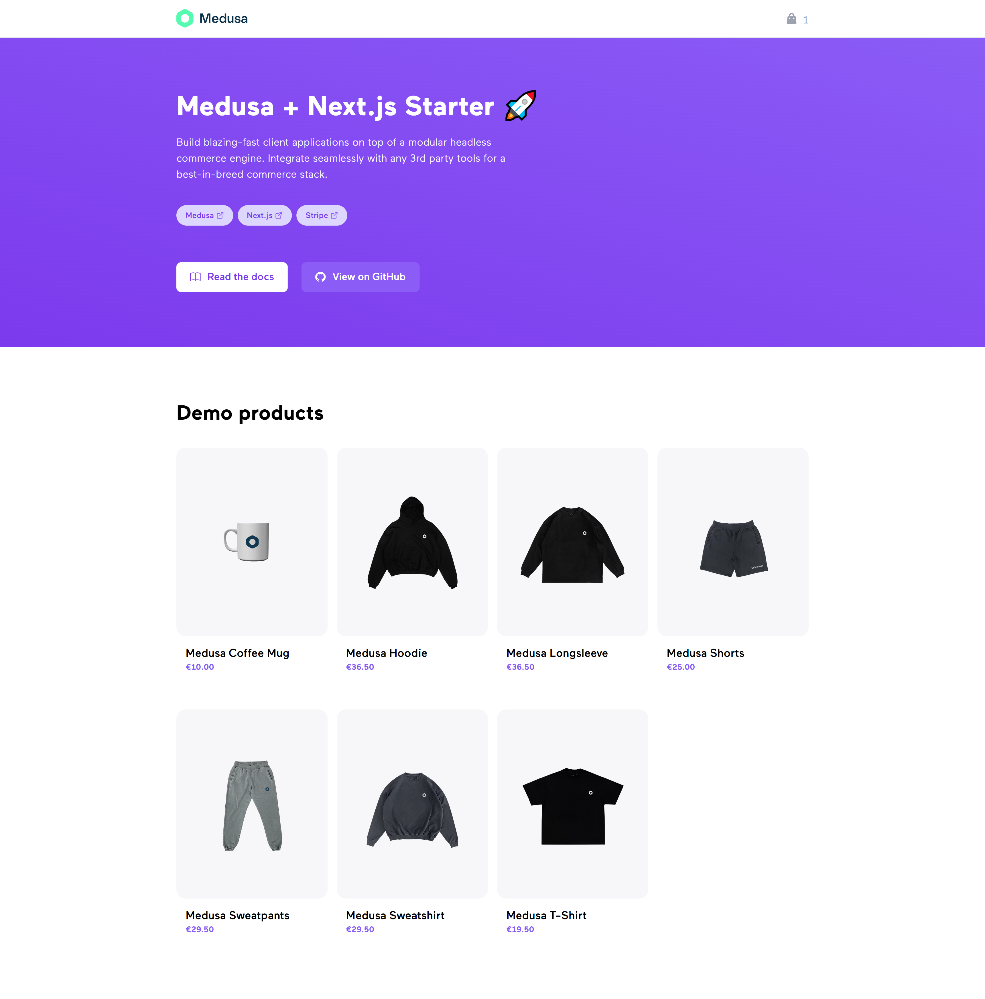

# Medusa Contest: Next.js Starter

> By Florian LEFEBVRE

Customize the Homepage of Our Next.js Storefront And Win a T-Shirt From Medusa! [Dev.to article](https://dev.to/medusajs/customize-the-homepage-of-our-nextjs-storefront-and-win-a-t-shirt-from-medusa-2fde)



> **Prerequisites**: To use the starter you should have a Medusa server running locally on port 9000. Check out [medusa-starter-default](https://github.com/medusajs/medusa-starter-default) for a quick setup.

## Quickstart

1. **Setting up the environment variables**

   Navigate into your projects directory and get your enviroment variables ready:

   ```shell
   cd nextjs-starter-medusa/
   mv .env.template .env.local
   ```

   Add your Stripe API key to your `.env.local`

   ```
   NEXT_PUBLIC_STRIPE_KEY=pk_test_something
   ```

2. **Install dependencies**

   Use Yarn to install all dependencies.

   ```shell
   yarn
   ```

3. **Start developing.**

   You are now ready to start up your project.

   ```shell
   yarn dev
   ```

4. **Open the code and start customizing!**

   Your site is now running at http://localhost:8000!

   Edit `/pages/index.js` to see your site update in real-time!

5. **Learn more about Medusa**

   - [Website](https://www.medusa-commerce.com/)
   - [GitHub](https://github.com/medusajs)
   - [Documentation](https://docs.medusa-commerce.com/)

6. **Learn more about Next.js**

   - [Documentation](https://nextjs.org/docs)
